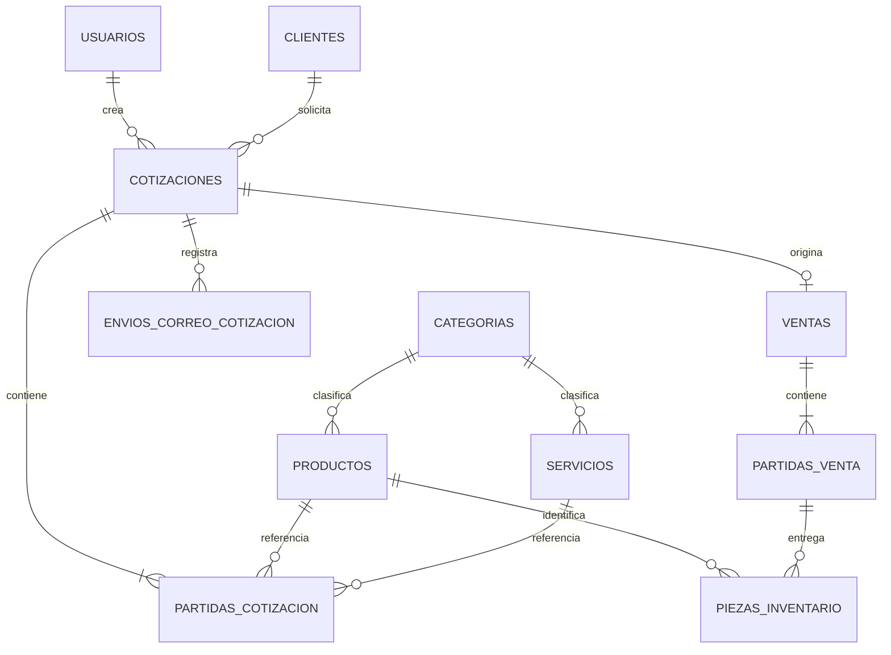

# Esquema de base de datos de COMUN&TEC

## Relaciones principales

## Tabla `usuarios`

| Columna | Tipo | Regla | Uso |
|---|---|---|---|
| `id` | entero | llave primaria | Identificador interno. |
| `nombre` | texto | obligatorio | Nombre mostrado en el sistema. |
| `correo` | texto | obligatorio y único | Inicio de sesión y contacto. |
| `correo_verificado_en` | fecha/hora | opcional | Reserva para verificación de correo. |
| `contrasena` | texto | obligatorio | Hash seguro; nunca almacena la contraseña legible. |
| `rol` | texto | administrador, comercial o consulta | Control de permisos. |
| `activo` | booleano | predeterminado verdadero | Permite bloquear el acceso sin borrar historial. |
| `token_recuerdo` | texto | opcional | Sesiones recordadas por Laravel. |
| `creado_en` | fecha/hora | automática | Auditoría de creación. |
| `actualizado_en` | fecha/hora | automática | Auditoría de actualización. |

El modelo `Usuario` aplica el cast `hashed` a `contrasena`. Laravel genera un hash unidireccional antes de persistirla. El campo también está oculto al serializar usuarios. El seeder usa `Hash::make` y toma la contraseña de una variable de entorno.

## Diccionario de las demás tablas

Todas las tablas de negocio incluyen `id` como llave primaria. Salvo donde se indique lo contrario, también incluyen `creado_en` y `actualizado_en` para auditoría.

### Tabla `clientes`

Guarda la información fiscal y de contacto de las personas físicas o morales que solicitan cotizaciones.

| Columna | Datos que guarda | Regla o relación |
|---|---|---|
| `id` | Identificador del cliente. | Llave primaria. |
| `tipo` | Persona física o moral. | Obligatorio. |
| `nombre` | Nombre de la persona o razón social. | Obligatorio. |
| `rfc` | Registro Federal de Contribuyentes. | Único. |
| `correo` | Correo del cliente. | Recibe cotizaciones y recordatorios. |
| `telefono` | Número de contacto. | Obligatorio. |
| `direccion` | Domicilio fiscal o comercial. | Obligatorio. |
| `codigo_postal` | Código postal del domicilio. | Máximo 10 caracteres. |
| `creado_en`, `actualizado_en` | Fechas de auditoría. | Automáticas. |

### Tabla `categorias`

Organiza productos y servicios sin mezclar los datos particulares de cada tipo.

| Columna | Datos que guarda | Regla o relación |
|---|---|---|
| `id` | Identificador de la categoría. | Llave primaria. |
| `nombre` | Nombre de la categoría. | Único. |
| `activo` | Indica si puede asignarse a nuevos registros. | Predeterminado verdadero. |
| `creado_en`, `actualizado_en` | Fechas de auditoría. | Automáticas. |

### Tabla `productos`

Guarda artículos físicos, su precio, existencias y configuración de números de serie.

| Columna | Datos que guarda | Regla o relación |
|---|---|---|
| `id` | Identificador del producto. | Llave primaria. |
| `categoria_id` | Categoría del producto. | Llave foránea opcional a `categorias.id`. |
| `nombre` | Nombre comercial. | Obligatorio. |
| `descripcion` | Características o detalles. | Opcional. |
| `codigo` | Código o SKU. | Único. |
| `marca` | Fabricante o marca. | Opcional. |
| `modelo` | Modelo comercial o técnico. | Opcional. |
| `unidad` | Unidad de manejo, por ejemplo pieza. | Obligatorio. |
| `precio` | Precio unitario con IVA. | Decimal de 12 dígitos y 2 decimales. |
| `existencias` | Cantidad disponible. | Entero sin negativos; inicia en 0. |
| `requiere_numero_serie` | Define si las series se solicitan al vender. | Booleano; inicia en falso. |
| `activo` | Permite usarlo en nuevas cotizaciones. | Booleano; inicia en verdadero. |
| `creado_en`, `actualizado_en` | Fechas de auditoría. | Automáticas. |

### Tabla `servicios`

Guarda conceptos de trabajo que no manejan existencias ni números de serie.

| Columna | Datos que guarda | Regla o relación |
|---|---|---|
| `id` | Identificador del servicio. | Llave primaria. |
| `categoria_id` | Categoría del servicio. | Llave foránea opcional a `categorias.id`. |
| `nombre` | Nombre del servicio. | Obligatorio. |
| `descripcion` | Alcance o características. | Opcional. |
| `codigo` | Código interno del servicio. | Único. |
| `unidad` | Forma de cobro, por ejemplo servicio, hora o instalación. | Obligatorio. |
| `precio` | Precio con IVA. | Decimal de 12 dígitos y 2 decimales. |
| `activo` | Permite agregarlo a nuevas cotizaciones. | Booleano; inicia en verdadero. |
| `creado_en`, `actualizado_en` | Fechas de auditoría. | Automáticas. |

### Tabla `cotizaciones`

Guarda el encabezado, responsable, estado, importes y plazos de cada propuesta comercial.

| Columna | Datos que guarda | Regla o relación |
|---|---|---|
| `id` | Identificador de la cotización. | Llave primaria. |
| `folio` | Folio comercial. | Único. |
| `cliente_id` | Cliente destinatario. | Llave foránea a `clientes.id`. |
| `usuario_id` | Usuario responsable. | Llave foránea a `usuarios.id`. |
| `area_solicitante` | Área del cliente que solicita la propuesta. | Opcional. |
| `notas` | Notas generales o términos comerciales capturados al crear la cotización. | Opcional. |
| `estado` | Borrador, pendiente, aceptada, rechazada, cancelada, vencida o venta. | Inicia como `borrador`. |
| `enviada_en` | Momento del primer envío. | Opcional hasta enviar. |
| `aceptada_en` | Momento de aceptación. | Opcional hasta aceptar. |
| `vence_en` | Límite de los 15 días hábiles para responder. | Opcional hasta enviar. |
| `entrega_limite_en` | Límite de los 5 días hábiles para entregar. | Opcional hasta aceptar. |
| `porcentaje_descuento` | Descuento global aplicado. | Decimal; 0 o rango permitido de 5 a 10 %. |
| `total` | Total final con IVA y descuento. | Decimal de 12 dígitos y 2 decimales. |
| `creado_en`, `actualizado_en` | Fechas de auditoría. | Automáticas. |

### Tabla `partidas_cotizacion`

Guarda cada renglón de una cotización y conserva sus datos históricos aunque después cambie el catálogo.

| Columna | Datos que guarda | Regla o relación |
|---|---|---|
| `id` | Identificador de la partida. | Llave primaria. |
| `cotizacion_id` | Cotización propietaria. | Llave foránea a `cotizaciones.id`; se elimina con ella. |
| `producto_id` | Producto seleccionado. | Llave foránea opcional a `productos.id`. |
| `servicio_id` | Servicio seleccionado. | Llave foránea opcional a `servicios.id`. |
| `tipo` | Producto o servicio. | Inicia como `producto`. |
| `descripcion` | Descripción histórica cotizada. | No cambia si cambia el catálogo. |
| `cantidad` | Cantidad solicitada. | Decimal de 10 dígitos y 2 decimales. |
| `precio_unitario` | Precio histórico por unidad. | Decimal de 12 dígitos y 2 decimales. |
| `porcentaje_descuento` | Descuento aplicado únicamente al concepto. | Decimal entre 0 y 100. |
| `subtotal` | Cantidad por precio menos el descuento del concepto. | Decimal de 12 dígitos y 2 decimales. |
| `creado_en`, `actualizado_en` | Fechas de auditoría. | Automáticas. |

### Tabla `piezas_inventario`

Guarda los números de serie de productos serializables y permite rastrearlos desde la reserva hasta la venta.

| Columna | Datos que guarda | Regla o relación |
|---|---|---|
| `id` | Identificador de la pieza. | Llave primaria. |
| `producto_id` | Producto al que pertenece. | Llave foránea a `productos.id`; impide borrar el producto relacionado. |
| `cotizacion_id` | Cotización que reservó la pieza. | Llave foránea opcional a `cotizaciones.id`. |
| `partida_venta_id` | Partida en la que se entregó. | Llave foránea opcional a `partidas_venta.id`. |
| `numero_serie` | Serie física del equipo o componente. | Única. |
| `estado` | Disponible, reservada o entregada. | Inicia como `disponible`. |
| `creado_en`, `actualizado_en` | Fechas de auditoría. | Automáticas. |

### Tabla `envios_correo_cotizacion`

Registra cada intento de envío para auditoría y evita duplicar el recordatorio automático.

| Columna | Datos que guarda | Regla o relación |
|---|---|---|
| `id` | Identificador del intento. | Llave primaria. |
| `cotizacion_id` | Cotización enviada. | Llave foránea a `cotizaciones.id`; se elimina con ella. |
| `usuario_id` | Responsable asociado al envío. | Llave foránea a `usuarios.id`. |
| `destinatario` | Dirección de correo utilizada. | Obligatorio. |
| `tipo` | Envío de cotización o recordatorio. | `cotizacion` o `recordatorio`. |
| `resultado` | Resultado técnico del intento. | `aceptada` o `fallido`. |
| `mensaje` | Explicación del resultado. | Opcional. |
| `intentado_en` | Fecha y hora del intento. | Obligatorio. |
| `creado_en`, `actualizado_en` | Fechas de auditoría. | Automáticas. |

### Tabla `ventas`

Guarda el cierre administrativo de una cotización aceptada. Conserva una copia histórica de cliente y responsable.

| Columna | Datos que guarda | Regla o relación |
|---|---|---|
| `id` | Identificador de la venta. | Llave primaria. |
| `folio` | Folio de venta. | Único. |
| `cotizacion_id` | Cotización de origen. | Llave foránea única; impide generar dos ventas. |
| `cliente_id` | Cliente relacionado. | Llave foránea a `clientes.id`. |
| `usuario_id` | Responsable de la venta. | Llave foránea a `usuarios.id`. |
| `tipo_cliente` | Tipo histórico del cliente. | Copia al vender. |
| `nombre_cliente` | Nombre histórico del cliente. | Copia al vender. |
| `rfc_cliente` | RFC histórico. | Copia al vender. |
| `correo_cliente` | Correo histórico. | Copia al vender. |
| `telefono_cliente` | Teléfono histórico. | Copia al vender. |
| `direccion_cliente` | Dirección histórica. | Copia al vender. |
| `codigo_postal_cliente` | Código postal histórico. | Copia al vender. |
| `nombre_responsable` | Nombre histórico del responsable. | Copia al vender. |
| `correo_responsable` | Correo histórico del responsable. | Copia al vender. |
| `vendida_en` | Fecha y hora de conversión a venta. | Obligatorio. |
| `metodo_pago` | Efectivo, transferencia, tarjeta u otro. | Registro administrativo. |
| `detalle_metodo_pago` | Descripción cuando se elige otro. | Opcional. |
| `subtotal` | Importe antes del descuento. | Decimal. |
| `porcentaje_descuento` | Descuento histórico. | Decimal. |
| `total` | Importe final. | Decimal. |
| `creado_en`, `actualizado_en` | Fechas de auditoría. | Automáticas. |

### Tabla `partidas_venta`

Guarda los renglones históricos transferidos desde la cotización al cerrar la venta.

| Columna | Datos que guarda | Regla o relación |
|---|---|---|
| `id` | Identificador de la partida vendida. | Llave primaria. |
| `venta_id` | Venta propietaria. | Llave foránea a `ventas.id`; se elimina con ella. |
| `partida_cotizacion_id` | Partida de origen. | Llave foránea única a `partidas_cotizacion.id`. |
| `producto_id` | Producto vendido. | Llave foránea opcional a `productos.id`. |
| `servicio_id` | Servicio vendido. | Llave foránea opcional a `servicios.id`. |
| `tipo` | Producto o servicio. | Inicia como `producto`. |
| `descripcion` | Descripción histórica vendida. | Copiada desde la cotización. |
| `cantidad` | Cantidad vendida. | Decimal. |
| `precio_unitario` | Precio histórico por unidad. | Decimal. |
| `subtotal` | Importe de la partida. | Decimal. |
| `creado_en`, `actualizado_en` | Fechas de auditoría. | Automáticas. |

### Tabla técnica `migrations`

Laravel crea y administra esta tabla para registrar qué migraciones ya se ejecutaron y en qué lote. No contiene clientes, cotizaciones, ventas ni otra información comercial.

## Plazos de cotización y entrega

Las dos fechas están en la tabla `cotizaciones` porque pertenecen al ciclo de cada propuesta:

| Columna | Cuándo se llena | Significado |
|---|---|---|
| `enviada_en` | Al enviar la cotización por primera vez | Inicio de la vigencia comercial. |
| `vence_en` | Al enviar | Fin de los 15 días hábiles para responder. |
| `aceptada_en` | Al aceptar | Momento de aceptación y reserva de existencias. |
| `entrega_limite_en` | Al aceptar | Fin de los 5 días hábiles para entregar productos o servicios. |

Los días hábiles excluyen sábado y domingo. Los días festivos no se excluyen porque el proyecto todavía no administra un calendario oficial de feriados.

## Correos automáticos

`envios_correo_cotizacion` conserva cada intento. La columna `tipo` distingue el envío inicial de un `recordatorio`. El comando `cotizaciones:recordar-vencimiento` procesa únicamente cotizaciones pendientes un día hábil antes de `vence_en` y evita repetir un recordatorio aceptado por el servidor de correo.

El programador ejecuta diariamente:

- `08:00`: recordatorios de cotizaciones próximas a vencer.
- `08:10`: vencimiento de cotizaciones y liberación de reservas vencidas.

Para producción debe existir un proceso que ejecute `php artisan schedule:run` cada minuto.
