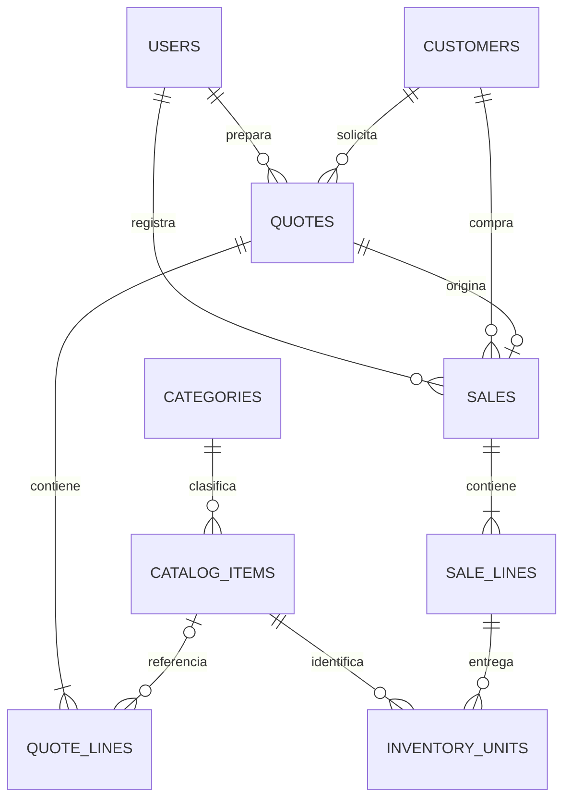

# Especificación: datos y permisos de la Entrega 1

Esta especificación traduce las decisiones aprobadas a un modelo implementable. No crea migraciones ni cambia el comportamiento de la aplicación hasta que se revise.

## Modelo de datos

### Usuarios

| Campo | Regla |
| --- | --- |
| nombre | obligatorio |
| correo | obligatorio, único |
| contraseña | almacenada con hash de Laravel |
| rol | `admin`, `comercial` o `consulta` |
| activo | un usuario desactivado no puede iniciar sesión |

No se eliminan usuarios que tengan cotizaciones o ventas relacionadas; se desactivan para preservar el historial.

### Clientes

| Campo | Regla |
| --- | --- |
| tipo | `fisica` o `moral` |
| nombre_razon_social | obligatorio |
| rfc | obligatorio según el requisito recibido; validar formato sin impedir correcciones justificadas |
| correo y teléfono | obligatorios para contacto y envío de cotización |
| dirección y código postal | obligatorios |

Un cliente puede tener muchas cotizaciones y ventas. Cada cotización tiene un campo opcional `area_solicitante`, útil cuando una empresa pide propuestas para áreas distintas.

### Catálogo e inventario por serie

| Entidad | Datos | Regla |
| --- | --- | --- |
| Categoría | nombre, activa | Ejemplos iniciales: CCTV, equipo de cómputo, redes e infraestructura tecnológica. |
| Artículo | tipo, nombre, descripción, marca, modelo, código, unidad, precio con IVA, categoría, activo | `tipo` distingue producto y servicio; el código es único. |
| Pieza de inventario | artículo, número de serie, estado, disponible | Cada producto físico entra como pieza individual con serie única. Servicios no generan piezas. |
| Movimiento | pieza o artículo, tipo, cantidad, motivo, usuario, fecha, referencia | Evidencia de altas, reservas, liberaciones y salidas. |

La existencia de un producto se calcula con sus piezas disponibles. El mínimo de 5 piezas dispara una alerta en el panel. La gestión de compras/proveedores queda fuera de esta entrega; se incorporarán piezas inicialmente mediante un ajuste de inventario autorizado.

### Cotizaciones y ventas

| Entidad | Datos | Reglas relevantes |
| --- | --- | --- |
| Cotización | folio único, cliente, área solicitante, responsable, estado, fechas de envío/aceptación/límite, descuento y totales | Mantiene precios y descripciones históricas. |
| Línea de cotización | tipo, artículo opcional, descripción histórica, cantidad, precio unitario, subtotal | Las líneas `otro` no tienen artículo ni inventario. |
| Venta | folio único, cotización única de origen, cliente, responsable, fecha, método de pago, totales | Solo puede existir una venta por cotización aceptada. |
| Línea de venta | descripción, cantidad, precio, subtotal | Copia el histórico de la cotización. |

Al **aceptar** una cotización se reserva la cantidad requerida de productos y se descuenta la disponibilidad. No se asignarán números de serie específicos todavía, porque la empresa puede seleccionar la pieza exacta al entregar.

Al **convertir a venta**, el Comercial selecciona los números de serie de las piezas reservadas y cada una queda ligada a su línea de venta y cliente. La cantidad de series seleccionadas debe coincidir con la cantidad del producto. Esto permite rastrear garantías e incidencias sin descontar inventario dos veces.

## Estados de piezas de inventario

| Estado | Significado |
| --- | --- |
| disponible | se puede reservar en una cotización aceptada |
| reservada | pertenece a una cotización aceptada aún no vendida |
| vendida | quedó ligada a una venta y no puede volver a usarse |
| inactiva | no está disponible por baja, daño o corrección autorizada |

Si se edita o cancela una cotización aceptada, sus piezas `reservada` vuelven a `disponible`. La cancelación automática de los 5 días usa la misma reversión.

## Matriz de permisos de servidor

| Recurso / acción | Admin | Comercial | Consulta |
| --- | --- | --- | --- |
| Panel, alertas e historial | Ver | Ver | Ver |
| Usuarios y roles | Crear, editar, desactivar | Sin acceso | Sin acceso |
| Clientes | Crear, editar, ver | Crear, editar, ver | Ver |
| Categorías, productos, servicios e inventario | Crear, editar, ver, ajustar | Crear, editar, ver, ajustar | Ver |
| Cotizaciones | Crear, editar, enviar, cambiar estado, PDF, ver | Crear, editar, enviar, cambiar estado, PDF, ver | Ver y PDF |
| Ventas | Convertir, ver | Convertir, ver | Ver |
| Reportes | Ver y exportar | Ver y exportar | Ver y exportar |

Las rutas, controladores y políticas deben aplicar esta matriz. Ocultar un botón no se considera control de acceso.

## Criterios de aceptación para implementar esta entrega

1. Las migraciones expresan las relaciones y restricciones únicas de correo, RFC cuando aplique, códigos, folios, series y venta por cotización.
2. Ninguna eliminación rompe historial; los registros se desactivan o se preservan mediante claves foráneas.
3. La disponibilidad se calcula solo con piezas `disponible`; nunca es negativa.
4. Una venta solo puede enlazar las piezas reservadas de su propia cotización.
5. Las pruebas cubren los tres roles y solicitudes directas no autorizadas.

## Decisión aprobada

Los números de serie se asignan al convertir una cotización en venta, no al momento de aceptarla. La aceptación reserva la cantidad; la venta identifica las piezas exactas entregadas. Esta regla queda aprobada para las migraciones de inventario y venta.
