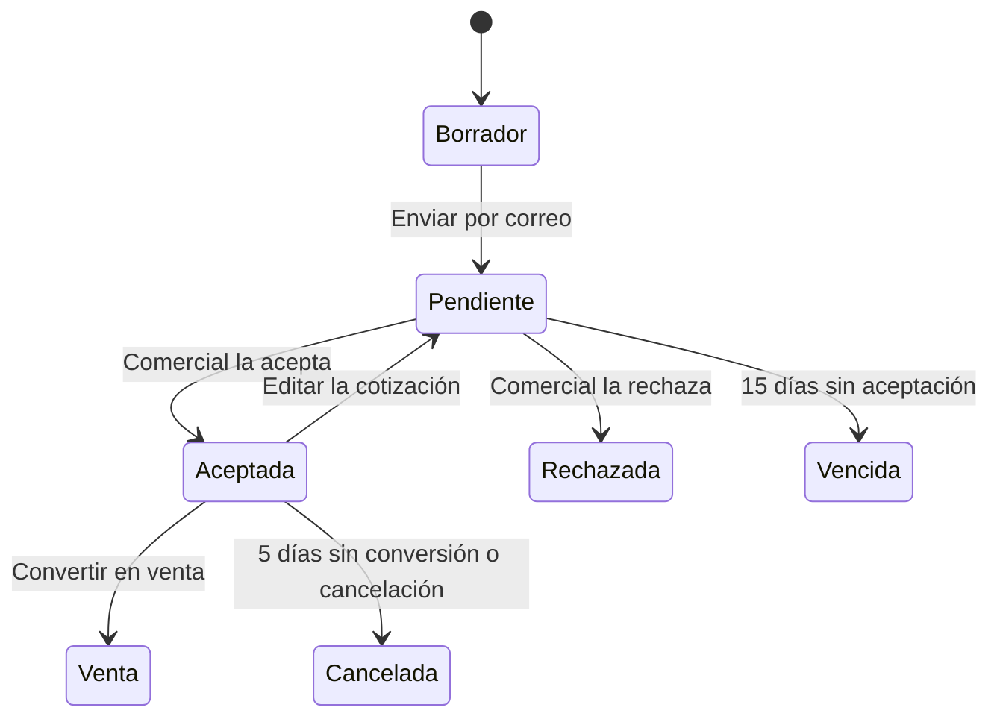

# Plan de implementación de Comunitec

## Propósito de la primera versión

Construir en Laravel una aplicación administrativa para que COMUN&TEC controle clientes, catálogo, cotizaciones y ventas derivadas de cotizaciones. La aplicación sustituirá los registros separados de Word y Excel mediante un único historial comercial.

La venta representa el cierre administrativo de una cotización aceptada. No se integrará una pasarela de pago.

## Alcance aprobado

| Capacidad | Incluye | Resultado comprobable |
| --- | --- | --- |
| Acceso y permisos | Inicio de sesión, usuarios activos/inactivos y roles Administrador, Comercial y Consulta | Un usuario de Consulta puede ver información, pero no crear ni modificar registros mediante la interfaz ni solicitudes directas. |
| Clientes | Alta, consulta, edición, búsqueda, datos fiscales, contacto e historial | Una cotización se puede asociar a una persona física o moral con datos completos. |
| Catálogo | Productos físicos, servicios y categorías básicas | Un producto conserva precio con IVA incluido, marca, modelo y código; cada pieza inventariable puede tener número de serie. Un servicio no mueve inventario. |
| Inventario | Existencia inicial, ajustes autorizados, stock mínimo de 5 y alertas en panel | Las alertas aparecen cuando un producto llega a 5 piezas o menos, sin enviar correo. |
| Cotizaciones | Folio, cliente, responsable, líneas, descuento global, estados, PDF y envío manual por correo | El PDF reproduce las partidas, importes, descuento y total guardados. |
| Conceptos libres | Línea de tipo Otro con descripción, cantidad y precio unitario | Se calcula en el total sin afectar inventario. |
| Venta | Conversión manual desde una cotización aceptada y método de pago | Una venta conserva vínculo, cliente, partidas y precios históricos de su cotización. |
| Panel y reportes | Indicadores, alertas, búsquedas, filtros e historial | Las cifras de los reportes coinciden con las cotizaciones y ventas almacenadas. |

## Reglas de negocio cerradas

### Estados de una cotización

- **Borrador:** editable y sin vigencia activa.
- **Pendiente:** se genera al enviar manualmente el correo al cliente. Dura 15 días desde el envío.
- **Aceptada:** el usuario Comercial cambia el estado manualmente tras comunicarse con el cliente. En ese momento se comprueba el inventario y se descuentan las existencias de productos físicos.
- **Rechazada** y **Vencida:** no pueden convertirse en venta. No afectan inventario.
- **Cancelada:** si había sido aceptada, devuelve automáticamente las existencias descontadas.
- Una cotización aceptada tiene 5 días para convertirse en venta. Al terminar el plazo se cancela automáticamente y devuelve sus existencias.
- Editar una cotización aceptada la devuelve a Pendiente: se liberan las existencias reservadas de su versión anterior y, al volver a aceptarse, se descuentan las de la versión actual. La conversión a venta no descuenta inventario por segunda vez.

### Importes, líneas e inventario

- Todos los precios ya incluyen IVA. La primera versión no separa ni calcula IVA adicional.
- El descuento es único y global por cotización, con porcentaje permitido de 5% a 10%.
- Productos, servicios y conceptos Otros contienen cantidad, precio unitario y subtotal. Solo los productos físicos afectan inventario y todos deben tener un número de serie por pieza.
- Al crear o editar una cotización se permite exceder la disponibilidad, pero se muestra una advertencia. Al aceptarla se bloquea la operación si no hay existencias suficientes; el inventario nunca puede ser negativo.
- El stock mínimo de los productos físicos es de 5 piezas.

### Venta y pago

- No existen ventas directas: toda venta proviene de una cotización aceptada.
- Convertir en venta es una acción manual separada de la aceptación.
- La venta registra solamente uno de estos métodos de pago: efectivo, transferencia, tarjeta u otro. No incluye pagos parciales, referencias ni comprobantes.

### Documento y comunicación

- La cotización se descarga como PDF y se envía mediante una acción manual del Comercial.
- El envío cambia Borrador a Pendiente. No hay aceptación pública, comentarios del cliente ni envíos automáticos.
- El envío de correo requerirá una configuración SMTP autorizada y un entorno de prueba antes de usar destinatarios reales.

## Diseño funcional propuesto

### Roles

| Acción | Administrador | Comercial | Consulta |
| --- | --- | --- | --- |
| Gestionar usuarios y roles | Sí | No | No |
| Gestionar clientes, catálogo e inventario | Sí | Sí | No |
| Crear, editar, enviar y cambiar estado de cotizaciones | Sí | Sí | No |
| Convertir cotización en venta | Sí | Sí | No |
| Consultar panel, historial y reportes | Sí | Sí | Sí |

El Administrador puede crear, editar, desactivar y asignar roles. El sistema conservará registros históricos vinculados aunque un usuario se desactive.

### Entidades iniciales

| Entidad | Datos clave | Relaciones |
| --- | --- | --- |
| Usuario | nombre, correo, contraseña, rol, activo | responsable de cotizaciones y ventas |
| Cliente | tipo: persona física/moral, nombre o razón social, RFC, correo, teléfono, dirección y código postal | cotizaciones y ventas |
| Categoría | nombre, activa | productos y servicios |
| Artículo de catálogo | tipo: producto/servicio, nombre, descripción, marca, modelo, código, unidad, precio con IVA, activo | categoría y líneas de cotización |
| Pieza de inventario | artículo, número de serie obligatorio, estado y disponibilidad | solo para productos físicos; al venderse queda ligada a su línea de venta |
| Inventario | artículo, existencia, movimientos, motivo, responsable y fecha | solo para productos |
| Cotización | folio, cliente, área solicitante opcional, responsable, estado, emisión, envío, aceptación, límite de conversión, descuento y totales | líneas, venta de origen y envíos |
| Línea de cotización | tipo, referencia opcional de catálogo, descripción histórica, cantidad, precio unitario, subtotal | cotización |
| Venta | folio, cotización de origen única, cliente, responsable, fecha, método de pago y total histórico | líneas copiadas de la cotización y piezas entregadas por número de serie |

Los importes se guardarán como decimales de precisión monetaria; las líneas copiarán descripción y precio para conservar el historial aunque el catálogo cambie.

## Orden de entrega

### Entrega 0: base reproducible

1. Confirmar entorno Laravel, base MySQL de desarrollo, variables locales y pruebas iniciales.
2. Establecer convenciones de ramas, commits y archivo de ejemplo de configuración.
3. Crear datos de desarrollo que no sean reales.

**Aceptación:** aplicación inicia, migraciones funcionan en una base de desarrollo y la compilación del frontend termina sin errores.

### Entrega 1: modelo de datos, acceso y permisos

1. Especificar migraciones y relaciones para usuarios, roles y auditoría básica.
2. Implementar autenticación y administración de usuarios activos.
3. Proteger rutas y acciones de servidor según la matriz de roles.

**Aceptación:** cada rol ve únicamente sus opciones autorizadas y las operaciones no permitidas responden con prohibición desde el servidor.

### Entrega 2: clientes, catálogo e inventario inicial

1. Implementar clientes físicos y morales con datos fiscales, historial y área solicitante opcional por cotización.
2. Implementar productos, servicios, categorías (por ejemplo, CCTV, equipo de cómputo, redes e infraestructura tecnológica), existencias iniciales y piezas serializadas.
3. Registrar movimientos de inventario y alertas de mínimo.

**Aceptación:** se pueden elegir clientes y conceptos válidos para una cotización; el panel indica productos con 5 piezas o menos.

### Entrega 3: creación y cálculo de cotizaciones

1. Generar folio único, fechas, líneas de catálogo y líneas Otros.
2. Calcular subtotales, descuento global permitido y total en el servidor.
3. Guardar Borradores y advertir disponibilidad insuficiente sin impedir el guardado.

**Aceptación:** los cálculos no pueden manipularse desde el navegador y el historial conserva las descripciones y precios cotizados.

### Entrega 4: ciclo de estados, PDF y correo

1. Aplicar transiciones, vencimiento de 15 días y modificación de cotizaciones aceptadas.
2. Generar PDF verificable.
3. Implementar el envío manual de correo y registrar su resultado sin perder la cotización ante un fallo.

**Aceptación:** enviar mueve Borrador a Pendiente; el PDF coincide con los datos almacenados; no se envían correos reales sin configuración autorizada.

### Entrega 5: aceptación, reserva de inventario y venta

1. Bloquear aceptación si falta stock y descontar en una transacción si alcanza.
2. Revertir stock al editar o cancelar una aceptada; cancelar automáticamente tras 5 días sin venta.
3. Convertir una sola vez a venta, copiando datos y solicitando el método de pago.

**Aceptación:** no hay inventario negativo, descuento duplicado, venta duplicada ni registros parciales ante fallo.

### Entrega 6: panel, reportes y experiencia de uso

1. Construir panel con alertas, estados recientes e indicadores útiles.
2. Añadir filtros por fechas, cliente, responsable y estado; reportes de cotizaciones y ventas.
3. Revisar interfaz en móvil/escritorio, teclado, contraste, vacíos y errores.

**Aceptación:** los totales de reportes concilian con operaciones originales y el usuario de Consulta no puede modificar datos.

### Entrega 7: validación y entrega

1. Probar el flujo completo y los casos de error críticos.
2. Validar con usuarios, documentar incidencias y corregirlas.
3. Preparar manual técnico, manual de usuario, respaldo/restauración y despliegue cuando se autorice.

**Aceptación:** existe evidencia de pruebas, no quedan fallos críticos abiertos y los manuales describen la versión realmente instalada.

## Tareas inmediatas antes de programar módulos

1. Confirmar el entorno de desarrollo y dejarlo reproducible.
2. Redactar la especificación técnica de la Entrega 1, comenzando por el modelo de datos y la matriz de permisos.
3. Validar los datos corporativos que aparecerán en el PDF: nombre legal, logo, dirección, teléfono y correo remitente.
4. Definir el formato de folio y la moneda visible; se recomienda MXN y un folio consecutivo con año, pero no se implementará hasta confirmarlo.

## Decisiones aplazadas que no bloquean el plan

- Configuración SMTP y buzón autorizado para pruebas.
- Datos oficiales para el encabezado y pie del PDF.
- Proveedores, entradas de compra y reglas de ajuste manual de inventario.
- Formato definitivo de folios y datos fiscales.
- Detalle final de cada reporte y sus exportaciones.

Estas decisiones se resolverán antes de la entrega a la que afecten. No se inventarán datos corporativos ni credenciales.

## Entrega 8: traducción estructural completa al español

### Objetivo

Eliminar los identificadores en inglés creados por la aplicación y dejar una estructura coherente en español en código, rutas, formularios, pruebas y base de datos. El usuario autorizó vaciar la base, por lo que se conserva el comportamiento de la Entrega 7 y se reconstruye el esquema sin migrar registros anteriores.

No se traducirán palabras reservadas de PHP, SQL, HTML y HTTP, contratos públicos de Laravel ni código de `vendor` y `node_modules`. La infraestructura interna que Laravel exige con nombres fijos se documentará como excepción técnica. Esto no será una capa de traducción: los nombres persistidos y las referencias del código cambiarán realmente.

### Convenciones aprobadas para la migración

| Nombre anterior | Nombre definitivo |
| --- | --- |
| `users` | `usuarios` |
| `customers` | `clientes` |
| `categories` | `categorias` |
| `catalog_items` | `articulos_catalogo` |
| `inventory_units` | `piezas_inventario` |
| `quotes` | `cotizaciones` |
| `quote_lines` | `partidas_cotizacion` |
| `quote_email_deliveries` | `envios_correo_cotizacion` |
| `sales` | `ventas` |
| `sale_lines` | `partidas_venta` |

Las columnas propias usarán nombres como `nombre`, `correo`, `contrasena`, `rol`, `activo`, `cliente_id`, `usuario_id`, `cotizacion_id`, `articulo_catalogo_id`, `estado`, `tipo`, `descripcion`, `cantidad`, `precio_unitario`, `porcentaje_descuento`, `creado_en` y `actualizado_en`. Los estados y tipos persistidos también cambiarán: `producto`, `servicio`, `otro`; `borrador`, `pendiente`, `aceptada`, `rechazada`, `cancelada`, `vencida`; y `disponible`, `reservada`, `entregada`.

### Estrategia de seguridad de datos

1. Crear una rama de trabajo y un respaldo lógico antes de modificar el esquema.
2. Añadir pruebas que describan el esquema y los valores definitivos en español.
3. Sustituir el historial de desarrollo por una migración consolidada, porque el usuario autorizó una base vacía.
4. Hacer que toda instalación nueva nazca directamente en español.
5. Cambiar modelos, relaciones, controladores, servicios, comandos, correo, vistas y pruebas por bloques pequeños.
6. Probar una instalación limpia en MySQL y crear el primer administrador mediante variables locales no versionadas.

### Orden de implementación

1. **Usuarios y autenticación:** tabla, columnas, modelo, validación, sesiones y permisos.
2. **Clientes y catálogo:** clientes, categorías, artículos y piezas de inventario.
3. **Cotizaciones:** encabezado, partidas, estados, correo, PDF y reservas.
4. **Ventas y reportes:** copias históricas, partidas, series, filtros, panel y reportes.
5. **Limpieza del código:** nombres de variables enviados a vistas, parámetros de rutas, comandos heredados y referencias en documentación.
6. **Cierre:** búsqueda automática de identificadores anteriores, migración limpia, actualización sobre copia de datos, reversión, suite completa y revisión visual.

### Criterios de aceptación

- Una base nueva contiene nombres en español para todas las tablas y columnas propias de Comunitec.
- La base autorizada se reconstruye limpia y permite crear el administrador sin guardar contraseñas en Git.
- Los valores de tipos y estados almacenados quedan en español, sin adaptadores permanentes para los valores anteriores.
- No quedan referencias funcionales a nombres anteriores dentro de `app`, `database`, `resources`, `routes` y `tests`, salvo excepciones técnicas documentadas.
- La migración consolidada se puede revertir y ejecutar nuevamente en una base de prueba.
- El flujo completo, las pruebas, Blade, formato y compilación siguen aprobados.
